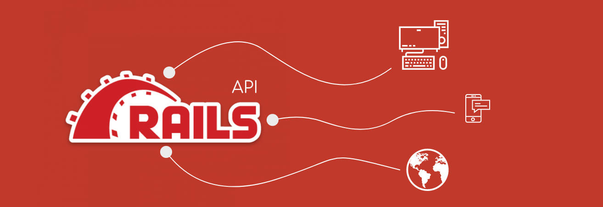

<!-- ReadMe -->

<h3 align="center">Welcome to OT367-SERVER</h3>
  

    RESTful Api in Ruby on Rails
    

    A RESTful API in Ruby on Rails is a web application programming interface that adheres to the principles of Representational State Transfer (REST) and is built using the Ruby on Rails framework. REST is a set of constraints and principles for designing networked applications that use HTTP. In a RESTful API, resources are represented as URLs, and HTTP methods (GET, POST, PUT, DELETE, etc.) are used to perform operations on these resources.
  

 

<!-- TABLE OF CONTENTS -->

  
Table of Contents

  <ol>
    <li>
      <a href="#about-the-project">About The Project</a>
      <ul>
        <li><a href="#built-with">Built With</a></li>
      </ul>
    </li>
    <li>
      <a href="#getting-started">Getting Started</a>
      <ul>
        <li><a href="#prerequisites">Prerequisites</a></li>
        <li><a href="#schema">Schema</a></li>
        <li><a href="#testing">Testing</a></li>
      </ul>
    </li>
    <li><a href="#endpoints">Endpoints</a></li>
    <li><a href="#apis">APIs Used</a></li>
    <li><a href="#technologies">Other Technologies Used</a></li>
    <li><a href="#contact">Contributors</a></li>
    <li><a href="#refactor">Future Iterations</a></li>
  </ol>

 

### Built With

<!-- GETTING STARTED -->
## Getting Started

If you'd like to demo this API on your local machine:
1. Ensure you have the prerequisites
2. Clone this repo: `git clone git@github.com:Tinix/OT367-SERVER.git
3. Navigate to the root folder: `cd OT367-SERVER
4. Run: `bundle install`
5. Run: `rails db:{create,migrate}`
6. Inspect the `/db/schema.rb` and compare to the 'Schema' section below to ensure migration has been done successfully
7. Run: `rails s`
8. Visit http://localhost:3000/

<!-- Prerequisites -->
### Prerequisites

- Ruby Version 3.2.2
- Rails Version 7.1.1
- Bundler Version 2.4.20
- RSpec Version 6.0

<!-- Testing -->
### Testing
To test the entire spec suite, run `bundle exec rspec`.
*All tests should be passing.*

(<a href="#readme-top">back to top</a>)

